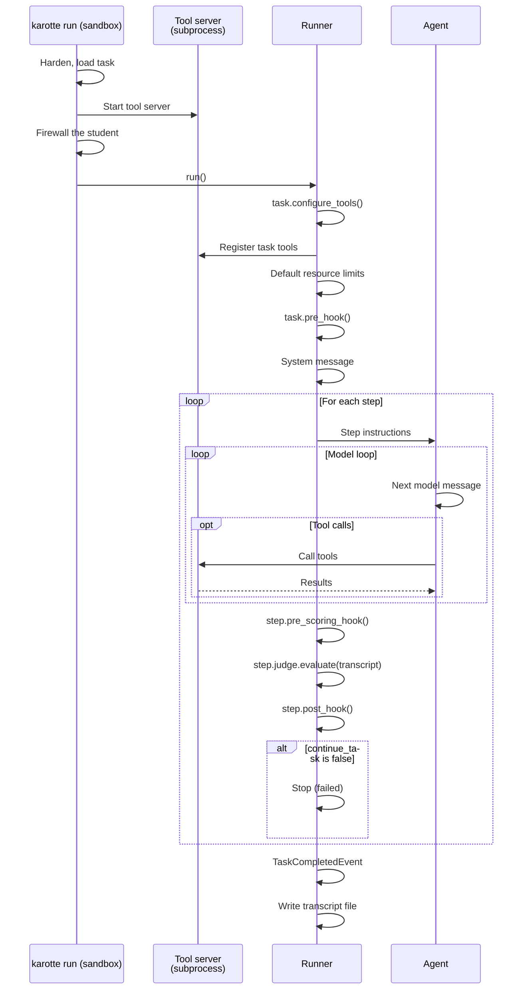

# Run lifecycle

This page walks through one `karotte run`, from the command line to the finished transcript.
The first part happens on your machine, the rest inside the sandbox that the [runtime](runtimes.md) starts.

## On your machine

```sh
uv run karotte run --config run_config.json
```

1. **Read the config.** `--config` can be JSON or a path to a JSON file.
   Karotte looks up the API keys in your shell (see [API keys](run-config.md#api-keys)).
   Then the run config preprocessors from [plugins](../extending/plugins.md) can rewrite the config, in order of their entry point names.
2. **Pick the runtime.** This is `--runtime` if you passed it, otherwise your platform's default for the task's hardware.
   Karotte checks that the runtime is installed and set up before it goes any further.
3. **Split parallel runs.** With `-n N`, run `i` gets the run id `<run_id>-<i>`, the transcript file `<name>_<i>.json`, and the websocket port plus `i`.
4. **Build the image** and tag it `karotte`.
   `--dev` skips this step; see [Development loop](development-loop.md).
5. **Remove leftover containers** from earlier runs.
   Karotte only removes containers whose names start with `karotte_run_` followed by the longest prefix all the run ids share, so commands with different run ids don't touch each other's containers.
6. **Start one sandbox per run**, named `karotte_run_<run_id>`.
   Inside it, Karotte runs itself again:

    ```sh
    /root/.venv/bin/karotte run --no-containerized --config <JSON>
    ```

    The directory that contains `transcript_file` is mounted into the sandbox, so the transcript and the artifacts end up next to each other on your machine.
    On `firecracker`, that directory goes into the VM on a drive and comes back out after the VM shuts down.
    The websocket port is published to your machine.

7. **Show progress.** The terminal UI connects to each run's websocket and shows its events as they happen.
   With `--no-ui`, Karotte prints every run's output straight to the terminal instead.
8. **Report.** Karotte prints where each transcript and artifact directory is.
   With `--no-ui`, it exits with a non-zero code if any run ended with an error.

## Inside the sandbox

1. **Harden the process.** Karotte removes every directory the student can write to from `PATH`, `LD_LIBRARY_PATH`, `LD_PRELOAD` and `LD_AUDIT`, and restarts itself.
   It also removes group and world write permission from mount points the runtime left writable, except the workdir and the temp directories.
2. **Load the task** from the `environment` package.
3. **Start the tool server.** An HTTP [MCP](https://modelcontextprotocol.io/) server starts in a subprocess, on the host and port from `mcp_server_config`.
   It runs as root; see [Tools](../tasks/tools.md).
4. **Create the agent and set up the student's firewall.** The student can reach localhost and the sandbox's own addresses (see `KAROTTE_STUDENT_NETWORK` in [Runtimes](runtimes.md#environment-variables)).
   It can never reach the websocket port.
   It can only reach the tool server and the model proxy when a CLI agent needs them.
   Without a proxy, a CLI agent reaches its model through a forwarder on localhost (step 6).
   If the firewall rules were applied, Karotte then tries to reach a few outside addresses as the student, and refuses to run if any of them answers.
   With `use_fake_model`, the fake model takes the agent's place here.
5. **Start the event streams**: the terminal output, the websocket, and the backend if `backend_uri` is set.
6. **Set up the task:**
    1. Karotte calls `task.configure_tools()` and registers the task's tools with the tool server.
       Tools that a CLI agent brings itself are skipped.
    2. If a file already exists at `transcript_file`, it's deleted.
    3. Karotte records a `TaskStartedEvent`.
    4. The default [student resource limits](student-resources.md) are applied, and Karotte logs which kind of confinement is in effect.
    5. Karotte calls `task.pre_hook()`.
       Whatever it returns goes into the transcript as the metadata of a `TaskPreHookCompletedEvent`.
    6. Karotte adds the system message from `task.system_prompt`.
       It skips this when the property returns `None`, and for CLI agents, which send their own.
    7. Karotte starts the agent. Without a model proxy, a CLI agent's model calls go through a forwarder on a local port, which adds the API key and sends them on to the provider.
7. **Run the steps.** For each step:
    1. Karotte records a `StepStartedEvent`.
    2. The step's instructions go to the agent as a user message, with any `extra_config` changes applied; see [Extra config](run-config.md#extra-config).
    3. The agent works on the step (see [The model loop](#the-model-loop)).
    4. Files listed in `extra_config["extra_artifact_paths"]` are saved as artifacts.
    5. Karotte calls `step.pre_scoring_hook()`, then `step.judge.evaluate(transcript)`, which produces a `ScoringEvent`.
       If either raises a `StudentMisbehaviorError`, the step scores 0; see [Scoring](../tasks/scoring.md).
    6. Karotte calls `step.post_hook()`.
    7. Karotte records a `StepCompletedEvent`.
       If the judge said not to continue, the remaining steps are skipped and the run counts as failed.
8. **Finish.** Karotte records a `TaskCompletedEvent` with status `passed` or `failed`.
   If an exception happens anywhere in the run, Karotte records an `ErrorEvent` instead and the run ends with status `error`.
9. **Write the transcript** to `transcript_file`, even after an error.
   Then Karotte gives the transcript and the artifacts to the owner of the directory they were written to, so a container running as root doesn't leave root-owned files on your machine.
   Finally, the tool server stops.

The hooks are described in [Tasks and steps](../tasks/tasks-and-steps.md).



## The model loop

The `builtin` agent calls the model through litellm with the transcript's messages and the task's tools, and streams the response.
If the response contains tool calls, Karotte runs them one at a time on the tool server, adds each result to the transcript, and calls the model again.
A turn without tool calls ends the step.

Some turns have neither text nor tool calls, because they were cut off at the output-token limit or only contain reasoning.
These don't end the step.
Karotte asks the model to continue instead, and gives up with an error after three of these turns in a row.

The `external` agent runs the same loop, but gets each message from the backend instead of calling a model.
It waits up to two hours for each message.
A CLI agent runs its own program once per step and calls the tools itself.

Karotte checks the [limits](run-config.md#limits) on turns, time and context between turns.

## What the run produces

| Output          | Where                                                                                                                                                                                                                                                            |
| --------------- | ---------------------------------------------------------------------------------------------------------------------------------------------------------------------------------------------------------------------------------------------------------------- |
| Transcript file | `transcript_file`, which is `out/transcript.json` by default. Written once, when the run ends.                                                                                                                                                                   |
| Artifacts       | `out/<run_id>_artifacts/`, next to the transcript. If that directory already exists, Karotte adds `_2`, `_3` and so on. With `backend_uri` set, they're uploaded to the backend instead. See [Artifacts and transcripts](../tasks/artifacts-and-transcripts.md). |
| Terminal output | Every event, printed as it happens. The terminal UI shows it per run; with `--no-ui`, it's printed directly.                                                                                                                                                     |
| Websocket       | Every event, on the port from `websocket_config`, for the terminal UI. The student can't reach it.                                                                                                                                                               |
| Backend         | Every event, sent over HTTP when `backend_uri` is set, plus the run's status and score. See [Backend](../extending/backend.md).                                                                                                                                  |

To look at the transcripts in a directory later, run `karotte dashboard out/`.

## Stop before the steps

`--prepare-only` sets up the sandbox the same way a real run does, up to and including the pre-hook and the system message.
Then it keeps the sandbox running without starting any steps or writing a transcript.
Use it to look around in a prepared sandbox:

```sh
uv run karotte run --config run_config.json --prepare-only
```

The sandbox is ready once `/tmp/karotte_prepared_<run_id>` exists inside it.
Press Ctrl-C to stop it.
It doesn't work with `-n` greater than 1, and it doesn't need a model API key.
