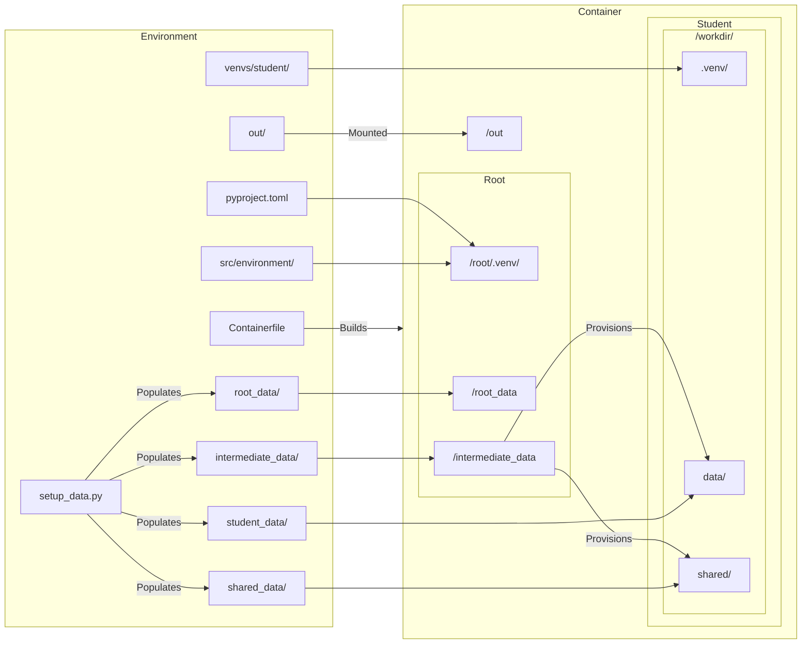

# Data and dependencies

It is important to keep any solutions to a task out of reach of the student.
This page covers the layout of the `default` template, which automatically takes care of permissions.

## Data directories

Each data directory in the environment's source layout lands in a fixed place in the image with fixed permissions.
`src/environment/paths.py` defines a constant for each.

| Environment              | Container            | Permissions       | Constant                | Purpose                                                                                                                                                               |
| ------------------------ | -------------------- | ----------------- | ----------------------- | --------------------------------------------------------------------------------------------------------------------------------------------------------------------- |
| `student_data/`          | `/workdir/data`      | Student-writable  | `STUDENT_DATA_DIR`      | Data the student needs to solve the task.                                                                                                                             |
| `venvs/student/`         | `/workdir/.venv`     | Student-writable  |                         | Python packages the student needs. See [Python dependencies](#python-dependencies).                                                                                   |
| `shared_data/`           | `/workdir/shared`    | Student-read-only | `SHARED_DATA_DIR`       | Data the student can use but not change. Safe to use for scoring.                                                                                                     |
| `root_data/`             | `/root_data`         | Root-only         | `ROOT_DATA_DIR`         | Data used for scoring. Invisible to the student.                                                                                                                      |
| `pyproject.toml`, `src/` | `/root/.venv`        | Root-only         |                         | Your environment code (tasks, tools, judges, hooks) and its dependencies.                                                                                             |
| `intermediate_data/`     | `/intermediate_data` | Root-only         | `INTERMEDIATE_DATA_DIR` | Data a task copies into place at runtime, for example from its `pre_hook` into `/workdir/data` or `/workdir/shared`. Only a convention: it behaves like `root_data/`. |

`/workdir` itself (`STUDENT_WORKDIR`) is the student's home and working directory.
It is root-owned with the sticky bit set, so the student can create files there but can't remove or rename `shared/` or other root-owned entries.

!!! warning

    Don't put the task's solution anywhere the student can read.

This is how the environment's files end up in the image:



`out/` stands for the directory of the run config's `transcript_file` (`out/transcript.json` by default).
It is mounted into the sandbox during a run to receive the transcript and artifacts.
See [Artifacts and transcripts](artifacts-and-transcripts.md).

### Large data: `setup_data.py`

If your data is large or binary, write `setup_data.py` to download, generate or preprocess it into the data directories.
It is a [uv script](https://docs.astral.sh/uv/guides/scripts/): declare its dependencies in the `# /// script` block at the top.
Run it before you build the image:

```bash
uv run setup_data.py
```

`karotte build` and `karotte run` don't run it for you.
Builds are faster if you preprocess the data once, upload the result to cloud storage, and only download it in `setup_data.py` (see [Google Cloud Storage](#google-cloud-storage)).

### Small data: commit it

Small text datasets can go into version control.
The template's `.gitignore` ignores the contents of the four data directories though, so remove the `student_data/**`-style lines for the directories you want to commit.

## Python dependencies

The image always has two virtual environments:

- **Root venv** (`/root/.venv`): built from the environment's top-level `pyproject.toml`.
  Karotte and your `src/environment/` code run here.
  Root-only.
- **Student venv** (`/workdir/.venv`): built from `venvs/student/pyproject.toml`.
  It is on the image's `PATH` so the student automatically works in it.

So:

- Does the student need packages such as numpy or pytest to solve your task?
  Add them to `venvs/student/pyproject.toml` and run `uv run just lock-venvs`.
- Does your environment code (tools, task setup, scoring) need packages?
  Add them to the top-level `pyproject.toml` with `uv add`.

### Additional venvs

Sometimes you may want to add additional venvs, for example to use a separate venv for scoring.
Every subdirectory of `venvs/` with a `pyproject.toml` becomes a venv in the image.
The `pyproject.toml` must pin a Python version and say where the venv goes and who can use it in a `[tool.karotte]` section:

```toml
[project]
name = "scoring-env"
version = "0.1.0"
requires-python = "==3.12.*"  # must be pinned
dependencies = ["rich"]

[tool.uv]
exclude-newer = "7 days"

[tool.karotte]
access = "root"
path = "/root/venvs/scoring"  # absolute path inside the container
```

`uv run just lint` requires the `exclude-newer = "7 days"` setting in every `pyproject.toml` of the environment.

The access levels:

| `access`     | Ownership and permissions                                      | Recommended path                    |
| ------------ | -------------------------------------------------------------- | ----------------------------------- |
| `root`       | Root-owned, mode 0700. The student can't access it.            | `/root/venvs/<name>`                |
| `student:r`  | Root-owned and read-only for the student, like `shared_data/`. | `/workdir/venvs/<name>`             |
| `student:rw` | Owned by the student, full access.                             | `/workdir/.venv` (the student venv) |

Put `root` venvs under `/root/` so the student can't even see that they exist.
A visible but unreadable `/workdir/venvs/scoring/` could already leak information.

Use `student:r` for tooling the student should run but not change.
Its files are made read-only but keep their executable bit.
`student:rw` is what the student venv uses; you rarely need it for another venv.

### Lockfiles

Every venv directory needs a `uv.lock` to make your environment builds reproducible.
The build installs each venv with `uv sync --frozen`, so it fails without a lockfile.
Run `uv run just lock-venvs` after you create a venv or change its dependencies to update the lock files.

### Using a venv at runtime

Call a venv's executables by path.
For example, from a scoring script:

```python
subprocess.run(["/root/venvs/scoring/bin/python", "compute_score.py"], check=True)
```

## System dependencies

Does the student need non-Python software such as git or another language toolchain?
Install it in the `Containerfile` where it says `# INSTALL EXTRA SYSTEM DEPENDENCIES HERE`.
The image is based on Amazon Linux 2023, so packages come from `dnf`:

```dockerfile
# INSTALL EXTRA SYSTEM DEPENDENCIES HERE
RUN dnf install -y git && dnf clean all
```

For whole language toolchains, see [Language toolchains](../environments/language-toolchains.md).

## Network access

During a run, a firewall keeps the student off the network.
By default it can reach localhost and the sandbox's own addresses, except the ports of Karotte's progress stream and MCP server.
How the firewall is enforced depends on the runtime; see [Runtimes](../running/runtimes.md).

Without network, the student can't look up docs or download packages, so make sure to give it everything it needs to solve the task.

## Google Cloud Storage

Karotte has helpers to download and upload directories from and to Google Cloud Storage.
They need the `gcs` extra:

```bash
uv add 'karotte[gcs]'
```

```python
from karotte.gcs import download_gcs_dir, upload_gcs_dir

download_gcs_dir(
    bucket_name="my-bucket",
    gcs_prefix="models/my-model/",
    local_dir="./my-model",
)

upload_gcs_dir(
    local_dir="./my-model",
    bucket_name="my-bucket",
    gcs_prefix="models/my-model/",
)
```

They authenticate with your Google Cloud application default credentials.
Use them in `setup_data.py`, with `karotte[gcs]` in its script dependencies:

```python
# /// script
# requires-python = "==3.12.*"
# dependencies = ["karotte[gcs]"]
# ///
```

They don't work during a run: the image carries no cloud credentials, and `karotte check` fails the build if it finds gcloud's credential files in it.

## Protected store

To pass data between hooks, tools and judges without the student seeing it, use `ProtectedStore`.
It writes each entry to a file only root can read, under `~/.config/karotte/protected/`.

```python
from karotte import ProtectedStore
from pydantic import BaseModel


class Secret(BaseModel):
    answer: int


# In a pre_hook:
ProtectedStore().write("secret", Secret(answer=42))

# In a judge or scoring script:
secret = ProtectedStore().read("secret", Secret)
```

`write()` takes a string, bytes or a pydantic model.
`read()` takes the type to return: `str`, `bytes` or a pydantic model class.
