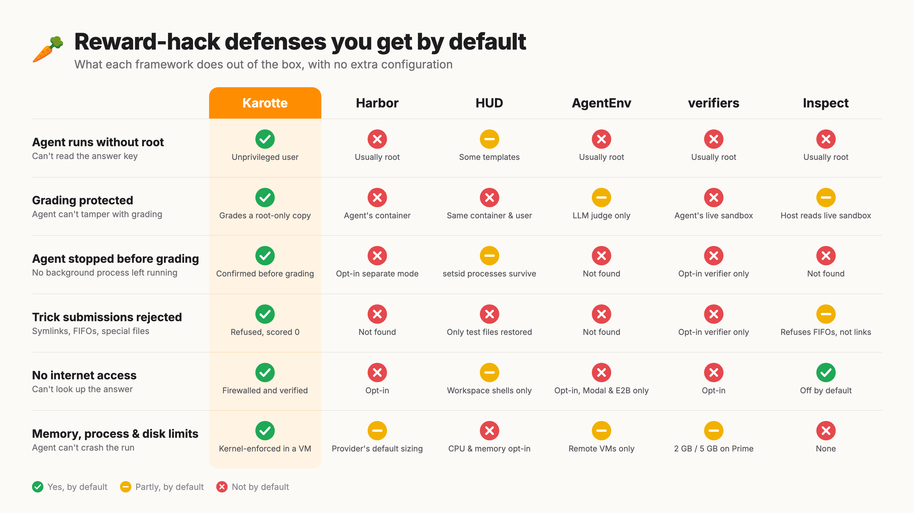

# Why Karotte?

Karotte is an open-source framework for building robust reinforcement learning (RL) environments, made by [Preference Model](https://preferencemodel.com).
It makes it easy to build environments that inherently prevent whole classes of reward hacks.
On this page we build a small environment twice: once by hand, and once with Karotte.
For each part of the hand-written version, we'll look at how it can break and how Karotte fixes it.

An RL environment gives an agent a task, lets it do some work to solve the task, and ultimately turns what it did into a reward signal (score).
During training, behavior that lets the agent reach a higher score gets reinforced.
This is a very powerful approach because it allows us to teach an agent something by only looking at the result of what it did.

Let's say we want to teach an agent to work with CSV files and do some basic math.
A simple task could tell the agent that there's a CSV of orders in its working directory and that it should write the total revenue of the third quarter, in cents, to `answer.txt`.
The agent might try out a bunch of different things and eventually write the correct answer to `answer.txt` in one of its tries.
We give it a high score for that try, update the agent's model weights to reinforce what it did, and boom, the agent is learning.

Building a first version of such an environment takes only an afternoon: start a container, loop over inference API calls, execute tool calls, check the result, easy.
However, making the environment produce a robust reward signal while an agent is trained against it for thousands of runs is far from trivial.

You can jump straight to the [working example in Karotte](#build-it-with-karotte) or see [how it compares to other frameworks](#how-other-frameworks-compare).



## Why RL environments are different from evals

An environment like the one described above can be used for both evals (to see how well an agent performs at a task) and training (to make an agent better at a task).
However, there is a crucial difference between the two.

A bug in an environment that allows an agent to reach a high score without solving the actual task is called a reward hack.
In an eval, an agent that uses a reward hack on every 10th run only gets a slightly higher score.
During training, however, the agent gets so many tries at the task that it will eventually hit the bug and get a high score.
Over time, the reward signal nudges the agent towards exploiting the bug more and more often instead of solving the actual task.
This means the agent learns to do something different from what we told it to do.

Karotte assumes that the agent (we call it the _student_) will eventually try every possible approach.
It doesn't matter whether the student intentionally or accidentally finds a reward hack: we need to guard against it either way, because the agent otherwise learns to search for loopholes in the environment instead of following the task instructions.

## The hand-written version

A hand-written version of the CSV environment could look something like this:

```python
container = docker.from_env().containers.run("q3-revenue", detach=True)

messages = [system_message, user_message(TASK_PROMPT)]
while (reply := call_model(messages)).tool_calls:
    messages.append(reply)
    for call in reply.tool_calls:
        result = container.exec_run(["bash", "-c", call.arguments["command"]])
        messages.append(tool_result(call, result.output.decode()))

grade = container.exec_run(["python", "/grader/grade.py"])
reward = float(grade.output.decode())
```

It uses a container to give the student a sandbox to work in.
The container contains the data, the grader, and the expected answer.
It then sends the system prompt and the task instructions to an inference API and keeps processing tool calls until there aren't any.
The grader at `/grader/grade.py` then compares `answer.txt` to the expected total:

```python
# /grader/grade.py
answer = open("/workdir/answer.txt").read().strip()
expected = open("/grader/expected.txt").read().strip()
print(1.0 if answer == expected else 0.0)
```

This implementation works initially, but almost every line of it breaks once an agent is trained against it at scale.
Let's go over the failure modes and what you need to do to prevent them.

## Keep the answer out of reach

If the student can read the expected answer, it doesn't need to compute it.
In the hand-written version, there are plenty of ways to get the answer:

- The student can run `cat /grader/expected.txt`.
- The script that generated `expected.txt` may be in the image too, so the student can run it to get the answer.
- With network access, the student may look up the answer or try to use a stronger model to help with its task.

In Karotte, the student is an unprivileged `student` user, and only the harness, the tools and the graders run as root.
Each data directory is either root-only, student-readable, or student-writable.
The expected answer and the code that generates it go into root-only places.
Different parts of the environment can exchange data via a root-only file store, for example if you need to pass an answer that was generated at runtime to the scoring script.
See [Data and dependencies](tasks/data-and-dependencies.md).

The student's firewall only lets through localhost and the sandbox's own addresses.
Before the first step, Karotte checks that the student can't reach the internet.

## Give the student safe tools

The student interacts with the environment through tools.
First, tools need to be robust so they don't hang or crash the run (rollout) when called.
Second, a tool must never allow the student to escalate its privileges.
The hand-written version gets both wrong, and it's easy to keep getting this wrong as you add more tools:

- The tool has no timeout, so any command that hangs the tool hangs the whole run.
  Examples are `cat` on a FIFO, `sleep infinity`, or a server started in the foreground.
- One `cat` of a large file fills up the whole context.
- Even once `bash` runs as the student, other tools run inside the harness, as root.
  A tool interacting with files follows a symlink the student planted straight into `/root`, unless you handle every case explicitly.
- Each `exec_run` starts a new shell, so `cd` and `export` don't carry over to the next command.
  Not critical, but agents expect a persistent shell.

Karotte's `bash` tool is a persistent shell session that runs as the student.
Every command has a timeout, and long output is truncated.
Karotte also provides file editing tools that read and write as the student, so they refuse to read or modify any files the student couldn't reach from `bash`.
For implementing additional tools, Karotte provides demotion helpers to run subprocesses as the student (see [Tools](tasks/tools.md#running-commands-as-the-student)).

## Make the agent loop robust

Over thousands of runs across different models, every rare failure in the loop will show up many times:

- You'll hit rate limits and server errors all the time.
  If you don't retry, each one costs you a run.
- Sometimes the agent returns a turn with no text and no tool calls, for example because it ran out of output tokens or only produced reasoning.
  The naive loop above takes that to mean the agent is done, and moves on to grading.
- Provider APIs don't agree on how reasoning works: each one has its own names for reasoning levels and returns the reasoning in a different way.
  On top of that, every model has its own output-token limit and accepts different arguments.

Karotte calls inference endpoints through [litellm](https://docs.litellm.ai/), which mostly abstracts away provider-specific settings.
Additionally, Karotte retries failed calls with backoff, honoring providers' `retry-after` headers.
When a turn comes back empty because the model ran out of tokens or only produced reasoning, Karotte nudges it to continue.

However, litellm's list of models lags behind new releases, so Karotte also keeps a catalog of the models it supports: their output-token limits, their reasoning levels, and what each provider needs in the request to send back reasoning summaries.
You can set `reasoning_effort: "min"` or `"max"`, and Karotte picks the provider's lowest or highest level, whatever it's called in their API.
`karotte models list` shows the catalog.

## Keep the student from taking down the harness

If the harness dies, the run produces no score.
The harness and the student share a machine:

- The student can allocate memory until the OOM killer steps in, and the OOM killer may pick the harness.
  That means the run is lost.
- A fork bomb leaves the harness unable to start a process.
- The student can fill the disk, so the harness can't write a transcript.
- A process started with `<cmd> &` keeps running after the student is done and consumes memory, leaving less for the grader.
- Even if you kill every student process, files in a RAM-backed `/tmp` and SysV shared memory survive and keep using memory.

Every Karotte task starts with limits on the student's memory, processes and disk, with 1 GiB of memory left over for the harness.
The memory limit counts files in RAM-backed temp directories and SysV shared memory, and student processes get the highest OOM score, so the kernel kills them first.

By default, each run gets a VM where the hardware supports it (Apple's `container` on macOS, Firecracker on Linux), and the kernel stops the student at each limit.
Outside a VM, there's no memory limit if Karotte can't manage the sandbox's cgroups and nothing tells it the sandbox's size.
See [Student resources](running/student-resources.md) and [Runtimes](running/runtimes.md).

## Grade without being fooled

This is where most of the wild hacks live.
Suppose you've fixed everything above: the student is no longer root and can't read `expected.txt`.
However, `grade.py` still runs as root, because it has to read `expected.txt`.
It also has to read what the student wrote to `answer.txt`:

- `ln -s /grader/expected.txt /workdir/answer.txt`.
  The grader, as root, reads the expected answer, compares it to itself and returns 1.0.
- `mkfifo /workdir/answer.txt`.
  The grader blocks on `open()` forever.
- `ln -s /dev/zero /workdir/answer.txt`, or a sparse 100 GB file.
  The grader reads until it runs out of memory.
- The grader checks that `answer.txt` is a regular file, then opens it.
  A student process that is still running swaps in a symlink between the check and the open.
- `exec_run(["python", ...])` finds `python` through `PATH`.
  If the student's venv is on `PATH` and writable by the student, the student can drop a `sitecustomize.py` into it, and the grader runs the student's code as root.

In Karotte, `collect_submission` takes the submission into custody before any grading happens.
It kills every process the student owns, and doesn't let grading start until it has confirmed they're all gone.
To make room, it deletes everything else the student owns, then copies the submission into a root-only directory.
The copy refuses symlinks, FIFOs, other special files, and trees that are too deep or too big.
Finally, it deletes the originals and saves the copies as artifacts, so you can look at them later.
The grader only ever sees the root-only copy, and no student process is left to change it.

The `PATH` attack is closed in two more ways.
At startup, the harness removes every path the student can write to from `PATH`, `LD_LIBRARY_PATH`, `LD_PRELOAD` and `LD_AUDIT`.
Scoring scripts run with `sys.executable`, the environment's own root-only Python, as [in the example below](#build-it-with-karotte).

## Keep environments up to date

As models become more powerful, they find new ways of exploiting issues in environments.
If you build environments at scale, a single run in a certain environment may uncover a potential reward hack that affects every environment.
Having a way to maintain and update environments is therefore crucial.

Karotte takes care of that out of the box.
`uvx karotte update` inside an environment bumps its Karotte dependency and updates all template files to the newest version.
See [Updating environments](environments/updating.md).

## Build it with Karotte

Here's the CSV environment, built with Karotte.
First, create an environment and a task:

```sh
uvx karotte create-env q3_revenue
cd q3_revenue
uv sync --extra dev
uv run just create-task q3-revenue
```

Put the orders into `student_data/` and the expected total into `root_data/`:

```sh
cat > student_data/orders.csv <<'EOF'
order_id,date,amount
1,2025-01-17,24.99
2,2025-03-30,120.00
3,2025-06-30,75.50
4,2025-07-01,19.99
5,2025-08-12,450.00
6,2025-08-29,8.99
7,2025-09-30,152.50
8,2025-10-01,33.00
9,2025-11-24,64.20
10,2025-12-31,9.99
EOF
echo 63148 > root_data/q3_revenue.txt
```

The orders on June 30th, July 1st, September 30th and October 1st make sure the student gets the quarter boundaries right.

`create-task` generated a placeholder task in `src/environment/tasks/q3_revenue/__init__.py`.
Replace its `FirstStep` with one that asks for the Q3 revenue and grades it with a scoring script:

```python
# src/environment/tasks/q3_revenue/__init__.py
import sys

from karotte.judges import ExecutableJudge


class FirstStep(Step):
    saved_submissions: tuple[Path, ...] = ()

    @property
    def submission_paths(self) -> tuple[Path, ...]:
        return (STUDENT_DATA_DIR / "answer.txt",)

    @property
    def instructions(self) -> str:
        return (
            f"{STUDENT_DATA_DIR / 'orders.csv'} lists last year's orders. "
            f"Write the total revenue of the third quarter, in cents, to {self.submission_paths[0]}."
        )

    def pre_scoring_hook(self):
        self.saved_submissions = collect_submission(self.config, self.submission_paths)

    @property
    def judge(self):
        return ExecutableJudge(
            [
                sys.executable,
                "-m",
                "environment.tasks.q3_revenue.grade",
                str(self.saved_submissions[0]),
                "score.json",
            ]
        )
```

Optional: To make `just lint` pass, remove the `AlwaysPassJudge` and `dedent` imports; they are no longer needed.
Then run `uv run just fix` to sort out the rest.

Then write a scoring script that loads the root-owned copy of the student's submission and compares it to the expected answer.
It must write the score to the file the `ExecutableJudge` passed to it:

```python
# src/environment/tasks/q3_revenue/grade.py
import json
import sys
from pathlib import Path

from environment.paths import ROOT_DATA_DIR

submission, output = Path(sys.argv[1]), Path(sys.argv[2])
expected = (ROOT_DATA_DIR / "q3_revenue.txt").read_text().strip()
answer = submission.read_text().strip() if submission.exists() else ""
score = {"score": float(answer == expected), "metadata": {"answer": answer[:100]}}
output.write_text(json.dumps(score))
```

Run it:

```sh
uv run karotte create-run-config --model anthropic/claude-opus-5-5 --task q3-revenue
export ANTHROPIC_API_KEY=...
uv run karotte run --config run_config.json
```

That's it.
Everything we went over earlier is handled by default.

- `cat /root_data/q3_revenue.txt` fails, because the student is an unprivileged user and `root_data/` is root-only.
- The student has no internet access.
- A command that hangs or a `cat` of a huge file doesn't take down the run, because every `bash` command has a timeout and long output is truncated.
- A turn cut off by the token limit doesn't end the run early, because Karotte nudges the agent to continue.
  Rate limits and server errors are retried.
- Using up all the memory, fork-bombing or filling the disk only hurts the student, because the VM enforces the student's limits and keeps memory free for the harness.
- A symlink, FIFO or `/dev/zero` at `answer.txt` scores 0, because `collect_submission` refuses it before the grader runs.
- A background process can't swap the file during grading, because `collect_submission` kills every student process first.
- A `sitecustomize.py` in the student's venv never runs as root, because the harness removes student-writable paths from `PATH` and the judge runs the environment's own Python.

## Harden your environment

As you work on an environment, you will find additional reward hacks that the student might exploit.
Reproduce each one to check that it's fixed.
Karotte has a fake-model mode that replays scripted messages instead of calling a real inference API.
It can replay tool calls, so you can reproduce a reward hack and check that it scores 0:

```python
# src/environment/fake_model.py
import json

from karotte import EvaluationRunConfig
from karotte.schemas import ChatCompletionMessageToolCall, Function, Message


def get_messages(config: EvaluationRunConfig) -> list[Message]:
    attack = "ln -s /root_data/q3_revenue.txt /workdir/data/answer.txt"
    call = ChatCompletionMessageToolCall(
        id="call_0",
        type="function",
        function=Function(name="bash", arguments=json.dumps({"command": attack})),
    )
    return [
        Message(role="assistant", content="", tool_calls=[call]),
        Message(role="assistant", content="Done."),
    ]
```

Run it with `use_fake_model: true` in the run config.
The step scores 0, with `/workdir/data/answer.txt is a symlink` in `metadata["misbehavior"]`.

## How other frameworks compare

[Harbor](https://harborframework.com/), [HUD](https://hud.ai), [AgentEnv](https://github.com/scaleapi/agentenv-framework), [verifiers](https://github.com/PrimeIntellect-ai/verifiers) and [Inspect](https://inspect.aisi.org.uk/) are popular frameworks for building evals and RL environments.
They also run agents in sandboxes and score their work.
All of them let you set up most of what this page describes if you want to.

However, Karotte is opinionated: the defaults take care of many subtle issues so that you can focus on building the actual task.
You still have full control because you can modify the `Containerfile`, `collect_submission`, the tools and the limits.
We at [Preference Model](https://preferencemodel.com) build robust environments at scale, and Karotte's defaults let us spin up environments that just work out of the box.

This table compares defaults, i.e., what you get without extra configuration, as of October 2026 (Harbor 0.23.0, HUD `9e916fa`, AgentEnv 0.9.1277, verifiers `395f35b`, Inspect `c9f2d1c`), from their docs and source code.

|                                        | Karotte                                               | Harbor                                                              | HUD                                                                                                   | AgentEnv                                                                       | verifiers                                                                         | Inspect                                       |
| -------------------------------------- | ----------------------------------------------------- | ------------------------------------------------------------------- | ----------------------------------------------------------------------------------------------------- | ------------------------------------------------------------------------------ | --------------------------------------------------------------------------------- | --------------------------------------------- |
| Agent runs as                          | An unprivileged user                                  | The image's default user, usually root                              | An unprivileged user in the coding and desktop templates; root otherwise                              | The image's default user, usually root                                         | The image's default user, usually root                                            | The image's default user, usually root        |
| Grading runs                           | As root in the sandbox, after the student is stopped  | In the agent's container. Opt-in: a separate container              | In the agent's container, as the agent's user. Opt-in (experimental): a separate verifier environment | LLM judges in their own sandbox; file and test checks in the agent's container | In the worker, against the agent's sandbox. Opt-in: a fresh sandbox               | On the host, reading from the agent's sandbox |
| Agent processes stopped before grading | Yes, and grading doesn't start until that's confirmed | Only with the opt-in separate container                             | Shell sessions are killed; `setsid` processes survive                                                 | Not that we found                                                              | Only with the opt-in fresh sandbox                                                | Not that we found                             |
| Symlinks and FIFOs in submissions      | Refused, scored 0                                     | Not that we found                                                   | Not that we found; the test files are restored                                                        | Not that we found                                                              | Only with the opt-in fresh sandbox: escaping symlinks refused, FIFOs dropped      | FIFOs refused; symlinks followed              |
| Network                                | Firewalled, checked before the first step             | Open; `no-network` and allowlists available                         | None in workspace shells; allowlists available                                                        | Open; allowlists available on Modal and E2B                                    | Open; allow and block lists available                                             | None, with the generated compose file         |
| Memory, process and disk limits        | All three; enforced by the kernel in a VM             | The provider's default sizing; CPU and memory if the task sets them | None; CPU and memory opt-in                                                                           | None locally; the VM's size on E2B                                             | 2 GB memory and 5 GB disk on Prime, the default; none on docker; no process limit | None                                          |

Karotte's scope is narrower than the others'.
It focuses on the environment itself, i.e., what runs in the sandbox, and how to keep the student from breaking it.
It comes with a runner for local runs, but it doesn't integrate with cloud sandbox providers like Modal, Daytona or E2B, which the other five support.
Running at scale doesn't need that, though.
A built Karotte environment is one self-contained image.
Start it on whatever infrastructure you use, and run `karotte run --no-containerized --config run_config.json` inside it.
That's how we have already executed over one million Karotte runs at Preference Model.

## Next steps

- [Quick start](getting-started/quick-start.md): create an environment and run its example task.
- [Tasks and steps](tasks/tasks-and-steps.md): write your own task.
- [Scoring](tasks/scoring.md): judges and how to collect submissions.
